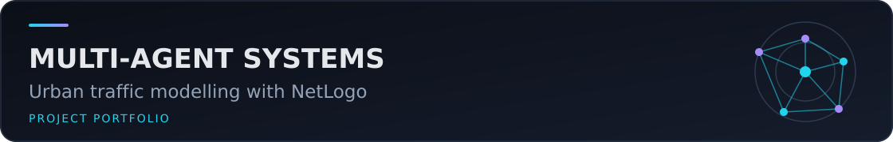
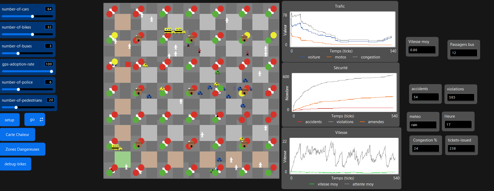

# Road Traffic Simulation MAS (Multi-Agent Systems)

Academic NetLogo project modelling urban road traffic as a multi-agent system. The submitted model represents cars, motorcycles, buses, pedestrians, police officers, traffic lights, roads and bus stops, with configurable demand, weather and GPS adoption.

## Scope and implemented behaviour

The NetLogo 7.0.2 source defines setup and simulation procedures, vehicle motion, buses and stops, pedestrians, police patrol, traffic-light control, accident checks, congestion/flow indicators and statistics. Adaptive decisions in the code are rule- and reward-inspired; the repository does **not** claim that a standard reinforcement-learning algorithm such as Q-learning was implemented or evaluated.

## Repository contents

- `model/PROJET-SMA.nlogox` — original NetLogo model source.
- `docs/academic-report-fr-redacted.pdf` — French academic report; phone numbers were removed from this public copy.
- `presentations/road-traffic-simulation-fr.pptx` — original French presentation, with document metadata cleaned.
- `images/` — submitted interface and agent-model figures.
- [Video demonstration (GitHub Release)](https://github.com/adamelakkaoui/road-traffic-simulation-mas-multi-agent-systems/releases/tag/academic-demo) — 24-minute French presentation and NetLogo demonstration.

## Running the model

Install NetLogo 7.0.2, open `model/PROJET-SMA.nlogox`, configure the interface controls, run `setup`, then start the main simulation procedure from the interface. NetLogo 6.x may not understand the `.nlogox` format.

## Data and evaluation

The model generates simulation state and indicators rather than using an external dataset. The report and interface expose traffic density, congestion, flow and safety-related observations. No independent benchmark or statistical replication is included in this portfolio copy.

## Results and limitations

The simulation results described in the report show that the multi-agent approach can reproduce realistic traffic phenomena and that the adaptive mechanisms improve traffic flow and reduce congestion compared with purely static behavior.

The report also identifies the main limitations: the model simplifies real traffic, does not capture the full diversity of human behavior or complex urban infrastructure, and uses a basic reinforcement-learning approach. Suggested extensions include more advanced RL methods such as Deep Q-Learning and the integration of real map data such as OpenStreetMap.

## Authors

- Adam El Akkaoui
- Mohammed Zaidouh
- Alaaeddine Haddout
